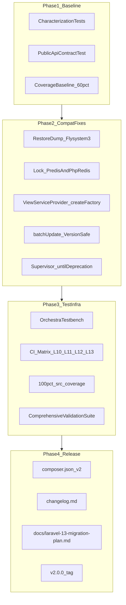

# Laravel 10–13 Migration Plan — halaei/helpers v2.0.0

This document is the authoritative reference for migrating `halaei/helpers` from v0.9.x (Laravel 8+) to **v2.0.0** (Laravel 10–13). It is intended for maintainers and for consumers upgrading dependent packages.

**Status:** Phase 0 complete — reference document created. Implementation phases 1–4 tracked below.

---

## Goal

Release **v2.0.0** so any dependent package moving to Laravel 13 can upgrade by changing composer only:

```json
"halaei/helpers": "^2.0"
```

### Constraints

| Constraint | Detail |
|------------|--------|
| Public API frozen | No renames, signature changes, or removal of documented macros, commands, or traits |
| Laravel support | `^10.0\|^11.0\|^12.0\|^13.0` |
| PHP | `^8.1` (Laravel 10 minimum) |
| Backwards compat for old consumers | Apps on Laravel 8–9 stay on `^0.9` — semver prevents forced upgrades |

---

## Architecture Overview



---

## Phase Checklist

| Phase | Description | Status |
|-------|-------------|--------|
| **0** | Create this reference document | Done |
| **1** | Baseline: characterization tests, `PublicApiContractTest`, coverage baseline | Pending |
| **2** | Compatibility fixes (Flysystem 3, Redis, View, batchUpdate) | Pending |
| **3** | 100% `src/` coverage + `ComprehensiveValidationTest` + CI matrix | Pending |
| **4** | Release: `composer.json`, changelog, README, tag `v2.0.0` | Pending |

---

## Consumer Upgrade (Composer Only)

### Upgrade to v2.0

```json
{
  "require": {
    "php": "^8.1",
    "halaei/helpers": "^2.0"
  }
}
```

No application code changes are required if the consumer already follows documented patterns in [README.md](../README.md).

**Optional:** If `Lock::instance()` is used and phpredis compatibility is not yet verified in your environment, set `REDIS_CLIENT=predis` in `.env` until phpredis support is confirmed.

### Rollback

Pin the previous major line:

```json
"halaei/helpers": "^0.9"
```

Run `composer update halaei/helpers`. No code changes needed to roll back.

---

## Public API Preservation Checklist

All items below **must remain** in v2.0.0. The `PublicApiContractTest` (Phase 1) enforces this via reflection on every CI matrix version.

### Supervisor (`Halaei\Helpers\Supervisor`)

| Unit | Must preserve |
|------|---------------|
| `Supervisor` | `__construct(Application, Cache, Bus, Events, ExceptionHandler)`, `supervise($command, ?SupervisorOptions): int` |
| `SupervisorOptions` | Public properties: `$timeout`, `$memory`, `$force`, `$stopOnError`, `$dontDie`; constructor with same defaults |
| `SupervisorState` | Public properties: `$paused`, `$shouldQuit`, `$lastRestart`, `$exitStatus` |
| `QuitsOnSignals` (trait) | Protected: `listenToSignals()`, `stopListeningToSignals()`, `quitIfSignaled($status = 0)` |
| Events | `Looping`, `LoopBeginning`, `LoopCompleting`, `RunSucceed`, `RunFailed`, `SupervisorStopping` |

**Documented usage:** `app(Supervisor::class)->supervise(CommandClass::class, ?SupervisorOptions)`

### Objects (`Halaei\Helpers\Objects`)

| Unit | Must preserve |
|------|---------------|
| `Rawable` | `toRaw()` |
| `Casting` | `static cast($value, $type, $name = null)` |
| `DataObject` | `__construct`, `relations()`, `all()`, `toArray()`, `toRaw()`, `toJson()`, `fuse()`, magic `__call/__get/__set/__isset/__unset` |
| `DataCollection` | `toRaw()`, `fuse()`, `unionBy()` + inherited `Collection` API |

### Eloquent (`Halaei\Helpers\Eloquent`)

| Unit | Must preserve |
|------|---------------|
| `Cacheable` (interface) | `isCached()`, `markAsCached()`, `syncWithDB()` |
| `CacheableTrait` | Same three methods |
| `EloquentCache` | `__construct`, `find`, `findBySecondaryKey`, `update`, `delete`, `invalidateCache`, `forget` |
| `HasCastables` | `bootHasCastables`, `attributesToArray`, `getAttribute`, `setAttribute`, `prepareSaving`, `offsetUnset`; consumer `static $castables` contract |
| `SqlState` | `is_integrity_constraint_violation`, `is_transaction_rollback` |
| `LogSlowQueries` (deprecated alias) | Class must extend `Commands\LogSlowQueries` |
| `EloquentServiceProvider` | `register`, `registerBatchUpdate`, `registerInsertIgnore` |

### Macros (registered by `EloquentServiceProvider`)

| Macro | Signature | Behavior |
|-------|-----------|----------|
| `Collection::update` | `()` | Batch-update dirty models via CASE WHEN SQL |
| `Builder::batchUpdate` | `($keyName, array $values)` | Internal batch update implementation |
| `Builder::insertIgnore` | `(array $values)` | INSERT IGNORE variant |

### Artisan Commands

| Class | Signature (unchanged) |
|-------|----------------------|
| `Commands\LogSlowQueries` | `db:log-slow-queries {--connection=} {--sleep=2} {--once}` |
| `Commands\BackupTableToFileSystem` | `db:backup-table {database} {table} {disk} {dir} {--truncate} {--auto-increment=id} {--mysqldump=mysqldump}` |
| `Commands\RestoreDumpFromFileSystem` | `db:restore-dump {database} {disk} {path} {--mysqlcli=mysql} {--force}` |

**Events (BackupTableToFileSystem):** `db:backup-table:starting`, `db:backup-table:done`

### Redis (`Halaei\Helpers\Redis`)

| Unit | Must preserve |
|------|---------------|
| `Lock` | `__construct(ClientInterface $redis)`, `instance($connection = null)`, `lock`, `unlock`, `block` |

### Listeners (`Halaei\Helpers\Listeners`)

| Unit | Must preserve |
|------|---------------|
| `RefreshDBConnections` | `handle()`, `static boot()` |
| `RandomWorkerTerminator` | `__construct($minTTL, $maxTTL)`, `handle()`, `static boot($minTTL, $maxTTL)` |

### View (`Halaei\Helpers\View`)

| Unit | Must preserve |
|------|---------------|
| `ViewFactory` | `yieldContent($section, $default = '')` — `@parent` must NOT stack |
| `ViewServiceProvider` | Registers `view` singleton using `ViewFactory` |

**Consumer pattern:** Replace `Illuminate\View\ViewServiceProvider` with `Halaei\Helpers\View\ViewServiceProvider` in `config/app.php`.

### Process / Crypt (pure PHP)

| Unit | Must preserve |
|------|---------------|
| `Process` | `__construct`, `run()`, `mustRun()`; public `$usleep`, `$waitForKill` |
| `ProcessResult` | Public `$exitCode`, `$stdOut`, `$stdErr`, `$timedOut`, `$readError` |
| `ProcessException` | Constants `CODE_START_ERROR`, `CODE_TIMEOUT_ERROR`, `CODE_EXIT_CODE_ERROR`; `$result`, `setResult()` |
| `NumCrypt` | `__construct`, `encrypt`, `decrypt` |

### Service Provider Registration (consumer-facing)

| Provider | Registration | Effect |
|----------|--------------|--------|
| `Eloquent\EloquentServiceProvider` | Manual in `config/app.php` | Registers `update`, `batchUpdate`, `insertIgnore` macros |
| `View\ViewServiceProvider` | Replace Illuminate provider | Custom `ViewFactory` |

**Not auto-registered:** `Supervisor`, `Lock`, Artisan commands — consumers wire these in their app.

---

## Per-File Change Log (v0.9.x → v2.0.0)

| File | Change | API impact |
|------|--------|------------|
| `composer.json` | PHP `^8.1`; add `illuminate/*` runtime deps `^10\|^11\|^12\|^13` | Consumers must be on Laravel 10+ |
| `src/Eloquent/Commands/RestoreDumpFromFileSystem.php` | Replace Flysystem v1 `MountManager` + `getDriver()` with `Storage::readStream` / `writeStream` | None — same command signature |
| `src/Redis/Lock.php` | Support phpredis via `instance()` adapter; keep `ClientInterface` constructor | None — Predis injection unchanged |
| `src/View/ViewServiceProvider.php` | Override `createFactory()` only (not `registerFactory()`) | None — same provider swap |
| `src/Eloquent/EloquentServiceProvider.php` | Remove dead `<5.3` branch; validate/fix `batchUpdate` bindings on L10–L13 | None — macro signatures unchanged |
| `src/Supervisor/Supervisor.php` | Add `@deprecated` on `events->until()` usage (internal) | None |
| `src/Listeners/RefreshDBConnections.php` | Catch `\Throwable` instead of `Exception` | None — `handle()` signature unchanged |
| `.travis.yml` | Removed | N/A |
| `.github/workflows/tests.yml` | Added L10–L13 matrix + coverage gate | N/A |
| `phpunit.xml` | PHPUnit 10+ coverage config, test groups | N/A |
| `tests/*` | Full suite rewrite/expansion for 100% coverage | N/A |

---

## Phase 1 — Baseline (Before Code Changes)

**Principle:** Capture current behavior first so migration fixes cannot silently drop features.

### 1.1 Public API Contract Test

**File:** `tests/PublicApiContractTest.php`

Uses PHP reflection to assert every public member from the checklist above exists with expected signatures. Runs on every CI matrix version. Fails if any public API is removed or renamed.

### 1.2 Characterization Tests

**Directory:** `tests/Characterization/`

| Test | Captures |
|------|----------|
| `SupervisorBehaviorTest` | Pause on maintenance, restart on `queue:restart`, event short-circuit |
| `EloquentMacroBehaviorTest` | CASE-WHEN SQL shape on SQLite via Testbench |
| `ViewParentBehaviorTest` | `@parent` does NOT stack (security fix) |
| `DataObjectBehaviorTest` | `toJson`, `all`, magic accessors |
| `LockBehaviorTest` | Redis lock contention (extends existing tests) |

Use explicit assertions on SQL strings and event counts — no snapshot files.

### 1.3 Coverage Baseline

Pre-migration estimated coverage: **~60–70%** of `src/`.

```bash
vendor/bin/phpunit --coverage-text
```

Target after Phase 3: **100% line coverage** of `src/`.

---

## Phase 2 — Compatibility Fixes

### composer.json (v2)

```json
{
  "require": {
    "php": "^8.1",
    "illuminate/support": "^10.0|^11.0|^12.0|^13.0",
    "illuminate/database": "^10.0|^11.0|^12.0|^13.0",
    "illuminate/cache": "^10.0|^11.0|^12.0|^13.0",
    "illuminate/console": "^10.0|^11.0|^12.0|^13.0",
    "illuminate/events": "^10.0|^11.0|^12.0|^13.0",
    "illuminate/redis": "^10.0|^11.0|^12.0|^13.0",
    "illuminate/view": "^10.0|^11.0|^12.0|^13.0",
    "illuminate/queue": "^10.0|^11.0|^12.0|^13.0",
    "illuminate/filesystem": "^10.0|^11.0|^12.0|^13.0"
  },
  "require-dev": {
    "orchestra/testbench": "^8.0|^9.0|^10.0|^11.0",
    "phpunit/phpunit": "^10.5|^11.0",
    "mockery/mockery": "^1.6",
    "predis/predis": "^2.0|^3.0"
  }
}
```

**Testbench mapping:** L10 → TB8, L11 → TB9, L12 → TB10, L13 → TB11.

### Critical fixes

1. **RestoreDumpFromFileSystem** — Flysystem 3 stream copy via `Storage` facade
2. **Redis Lock** — phpredis adapter in `instance()`; preserve `ClientInterface` constructor
3. **ViewServiceProvider** — `createFactory()` override only
4. **EloquentServiceProvider** — version-safe `batchUpdate`; remove `<5.3` branch

---

## Phase 3 — Test Suite (100% Coverage)

### Infrastructure

| File | Purpose |
|------|---------|
| `tests/TestCase.php` | Orchestra Testbench base; SQLite in-memory |
| `tests/PublicApiContractTest.php` | Reflection-based API gate |
| `tests/ComprehensiveValidationTest.php` | End-to-end smoke across all modules |

### ComprehensiveValidationTest flow

1. Register `EloquentServiceProvider` + `ViewServiceProvider`
2. Run `Collection::update()` + `insertIgnore` on SQLite
3. Instantiate `EloquentCache`, `Supervisor`, `Lock`, `DataObject`, `NumCrypt`, `Process`
4. Call `RefreshDBConnections::boot()`, `RandomWorkerTerminator::boot()`
5. Assert no exceptions; API contract preconditions still pass

### Test files (priority order)

| Priority | File | Covers |
|----------|------|--------|
| P0 | `EloquentServiceProviderTest.php` | Macros + SQLite (replaces broken `BatchUpdateTest`) |
| P0 | `ViewFactoryTest.php` | `@parent` disabled, provider binding |
| P0 | `RestoreDumpFromFileSystemTest.php` | Stream copy, mocked tar/mysql |
| P1 | `RefreshDBConnectionsTest.php` | Queue looping, rollBack, reconnect |
| P1 | `RandomWorkerTerminatorTest.php` | Worker stop after TTL |
| P1 | `LockInstanceTest.php` | `Lock::instance()` Predis + phpredis |
| P1 | `SupervisorCompleteTest.php` | RunFailed, memory limit, resolveCommand |
| P2 | `LogSlowQueriesCommandTest.php` | Mock processlist, `--once` |
| P2 | `BackupTableToFileSystemTest.php` | Mock mysqldump/tar/Storage |
| P2 | `QuitsOnSignalsTest.php` | `@group pcntl` |
| P3 | Edge-case expansions | `DataCollection::toRaw`, `CacheableTrait::syncWithDB`, etc. |

### PHPUnit groups

```xml
<groups>
  <exclude>
    <group>redis</group>
    <group>pcntl</group>
  </exclude>
</groups>
```

### Coverage enforcement

```bash
vendor/bin/phpunit --coverage-text --coverage-clover=build/coverage.xml
# CI fails if src/ line coverage < 100%
```

---

## Phase 4 — Release

### Changelog entry (v2.0.0)

```
# v2.0.0
- Laravel 10–13 support (PHP ^8.1)
- Fix RestoreDumpFromFileSystem for Flysystem 3
- Fix Redis Lock for phpredis default client
- Fix ViewServiceProvider for Laravel 11+ component cache
- 100% test coverage + comprehensive validation suite
- BREAKING: drops Laravel 8/9 and PHP 7.4 support (use ^0.9 for older Laravel)
```

### Tag

```bash
git tag -a v2.0.0 -m "Laravel 10-13 support with preserved public API"
```

---

## CI Test Matrix

### GitHub Actions matrix

| Laravel | Testbench | PHP |
|---------|-----------|-----|
| 10.* | ^8.0 | 8.1 |
| 11.* | ^9.0 | 8.2 |
| 12.* | ^10.0 | 8.2 |
| 13.* | ^11.0 | 8.3 |

**Services:** `redis:7`

### Per-job commands

```bash
composer install --no-interaction
vendor/bin/phpunit --testsuite HalaeiHelpers
vendor/bin/phpunit --filter PublicApiContractTest
vendor/bin/phpunit --filter ComprehensiveValidationTest
# Linux only:
vendor/bin/phpunit --coverage-text --coverage-clover=build/coverage.xml
```

### Local development (single version)

```bash
# Example: Laravel 11
composer require --dev orchestra/testbench:^9.0
vendor/bin/phpunit
```

---

## Risk Register

| Risk | Mitigation |
|------|------------|
| `batchUpdate` binding drift across L10–L13 | Characterization tests per matrix version; rewrite without binding mutation if needed |
| Redis Lock phpredis API differences | `LockInstanceTest` with both clients |
| Artisan commands need external binaries | Mock `Process` and `DB` in tests |
| `exit()` in Supervisor untestable | Stub subclass overriding `stop()`/`kill()` |
| `QuitsOnSignals` needs pcntl | `@group pcntl`; skip on Windows CI |

---

## Success Criteria

- [ ] `composer require halaei/helpers:^2.0` resolves on Laravel 10, 11, 12, 13
- [ ] `PublicApiContractTest` passes on all matrix versions
- [ ] `ComprehensiveValidationTest` passes on all matrix versions
- [ ] **100% line coverage** of `src/` (enforced in CI)
- [ ] All 3 Artisan command signatures unchanged
- [ ] All 3 macros behave identically on SQLite characterization fixtures
- [x] `docs/laravel-13-migration-plan.md` committed for future reference
- [ ] v2.0.0 tagged; `^0.9` consumers unaffected

---

## Execution Order

1. **Phase 0** — Create this document
2. **Phase 1** — Testbench + `PublicApiContractTest` + characterization tests on unchanged code
3. **Phase 2** — Compatibility fixes (one file at a time, green tests after each)
4. **Phase 3** — Remaining tests until 100% coverage + CI matrix
5. **Phase 4** — `composer.json`, changelog, README, tag `v2.0.0`

---

*Last updated: Phase 0 — reference document created.*
